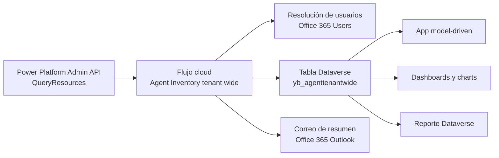

# Arquitectura funcional y técnica

## 1. Componentes

| Componente | Tipo | Nombre lógico / visible | Función |
| --- | --- | --- | --- |
| Persistencia | Dataverse | `yb_agenttenantwide` | Almacena el inventario consolidado de agentes |
| Automatización | Cloud flow | `Agent Inventory tenant wide` | Descubre, crea, actualiza y elimina registros del inventario |
| Presentación | Model-driven app | `Agent Inventory tenant wide APP` | Expone dashboards, navegación y acceso al inventario |
| Analítica | Dashboard clásico | `Agent Inventory – Tenant Overview` | Vista operacional con charts y grid |
| Analítica | Dashboard ejecutivo | `Agent Inventory – Overview Ejecutivo Tenant-wide` | Vista ejecutiva con filtros visuales y stream |
| Reporting | Reporte Dataverse | `Inventario de Agentes Tenant-wide` | Reporte tabular exportable |
| Parametrización | Variable de entorno | `yb_Notificacincorreosinformesflujo` | Destinatarios de correo del informe de ejecución |

## 2. Flujo de arquitectura

## 3. Arquitectura lógica

La arquitectura sigue un patrón simple de ingesta-operación-consumo:

- Ingesta: el flujo consulta el inventario administrativo de Power Platform.
- Normalización: los datos se proyectan y se transforman para encajar en la tabla Dataverse.
- Persistencia: Dataverse actúa como repositorio maestro del inventario.
- Consumo: la app, dashboards y reportes leen esa tabla.
- Notificación: el flujo emite un resumen de ejecución por correo.

## 4. Contexto de ejecución de conectores

Las referencias de conexión observadas son:

| Alias en flujo | Connection reference | Conector | Runtime source |
| --- | --- | --- | --- |
| `shared_powerplatformadminv2` | `yb_ConnectionReferencePowerPlatformAdminsTenantwide` | Power Platform Admins V2 | `invoker` |
| `shared_office365users_2` | `yb_sharedoffice365users_f32b7` | Office 365 Users | `invoker` |
| `shared_commondataserviceforapps_1` | `yb_ConnectionReferenceDataverseTenantwide` | Dataverse | `embedded` |
| `shared_office365_1` | `yb_ConnectionReferenceAgentInventoryTenantwide` | Office 365 Outlook | `invoker` |

Implicaciones:

- La lectura administrativa y la resolución de usuarios dependen del contexto del invocador.
- La escritura en Dataverse usa una referencia embebida.
- El correo de notificación también depende del contexto del invocador, salvo que la configuración del entorno fuerce el uso de una cuenta de servicio.

## 5. Dependencias declaradas

La solución exportada declara dependencias faltantes sobre:

- `CopilotStudioAccelerator (20260202.1)` para iconos `cat_/powercat/img/copilot.svg` y `cat_/powercat/img/home.svg`
- `msdyn_AppCopilotFeatures (9.2.2026015.260128051)` para `msdyn_CopilotIcon.svg` y `msdyn_CopilotIconWithColor.svg`
- `msdyn_AppFrameworkInfraExtensions (1.0.0.15)` para `AppChannel`
- `msdyn_M365CopilotAppInfraSettings (9.2.0.2)` para `m365copilotmodelappenabled`
- `msdyn_TimelineExtended (1.26022.2.7127)` para `msdyn_TimelineModernization`

## 6. App model-driven

La app `cr1d7_AgentControlHubtenantwide` contiene:

- la tabla `yb_agenttenantwide`,
- el dashboard clásico,
- el sitemap `Agent Control Hub tenant-wide`.

El sitemap expone dos subáreas:

- `Dashboard`
- `Agents`

## 7. Dashboards

### Dashboard clásico

Incluye:

- chart `agent by createdIn`
- chart `agentId by createdAt and createdIn`
- chart `agent by model`
- grid de la vista `Active agent tenant wides`

### Dashboard ejecutivo

Incluye:

- los mismos tres charts como filtros visuales
- un stream basado en la vista `Active agent tenant wides`

## 8. Patrón de clave funcional

La solución opera implícitamente con una clave de negocio compuesta:

- `agentId`
- `environmentId`

Esa clave se usa en el flujo para buscar registros existentes, pero no existe un `alternate key` de Dataverse exportado que la haga cumplir a nivel de datos.

## 9. Observaciones de arquitectura

- El modelo es correcto para consulta centralizada y reporting.
- La solución no incorpora todavía una capa de aprobación, certificación o remediation workflow.
- La sincronización es manual en la exportación observada; no se aprecia un disparador de calendario.

