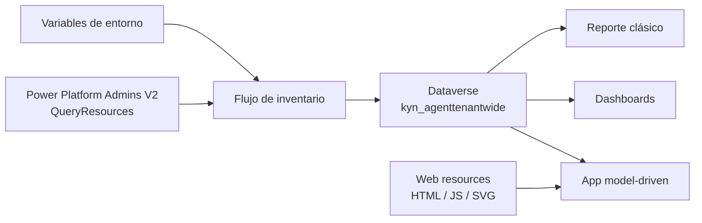

# Arquitectura funcional y técnica

## Componentes principales

| Capa | Componente | Función |
| --- | --- | --- |
| Descubrimiento | Flujo `KYN Agent Inventory tenant-wide` | consulta el origen administrativo y sincroniza Dataverse |
| Persistencia | Tabla `kyn_agenttenantwide` | almacena el inventario consolidado |
| Explotación | App `KYN Agent Inventory tenant-wide APP` | ofrece navegación, vistas y acceso a dashboards |
| Analítica | Dashboards clásicos | resumen operativo y ejecutivo |
| Reporting | Reporte clásico ligado a tabla | exportación y análisis tabular desde la entidad |
| Parametrización | Variables de entorno | destinatarios de correo y branding de empresa/cliente |
| Presentación | Web resources HTML, JS y SVG | bienvenida, dashboard visual e iconografía |

## Arquitectura lógica

## Dependencias técnicas

- Dataverse;
- conector `Power Platform Admins V2`;
- conector `Office 365 Users`;
- conector de correo para envío del informe;
- variables de entorno:
  - `kyn_Notificacincorreosinformesflujo`
  - `kyn_ClienteoEmpresaInformesflujo`

## Patrón de sincronización

La solución sigue un patrón de inventario incremental lógico:

- descubre agentes desde el origen soportado;
- intenta resolver metadatos de owner y creator;
- busca coincidencia por clave funcional;
- crea o actualiza solo cuando detecta cambios materiales;
- deja trazabilidad detallada del cambio;
- recalcula el estado operativo del registro según presencia o ausencia en el origen.

## Comportamiento operativo relevante

- `Activo` significa observado en la sincronización actual;
- `Inactivo` significa no observado en la sincronización actual;
- un registro inactivo puede volver a activo si reaparece;
- no se realiza borrado físico automático;
- el histórico permanece en Dataverse.

## Recursos visuales y experiencia

La `2.2.0.3` sí incluye `WebResources` en el paquete:

- iconos SVG de proveedor;
- recurso HTML de bienvenida;
- recurso HTML/JS preparado para iconografía dinámica de modelo;
- recurso visual para dashboard y navegación.

## Criterios de diseño

- solución importable entre tenants mediante variables de entorno y connection references;
- trazabilidad por encima de inferencias no soportadas;
- visibilidad operativa antes que complejidad analítica;
- separación entre usuarios consumidores y administradores técnicos.
