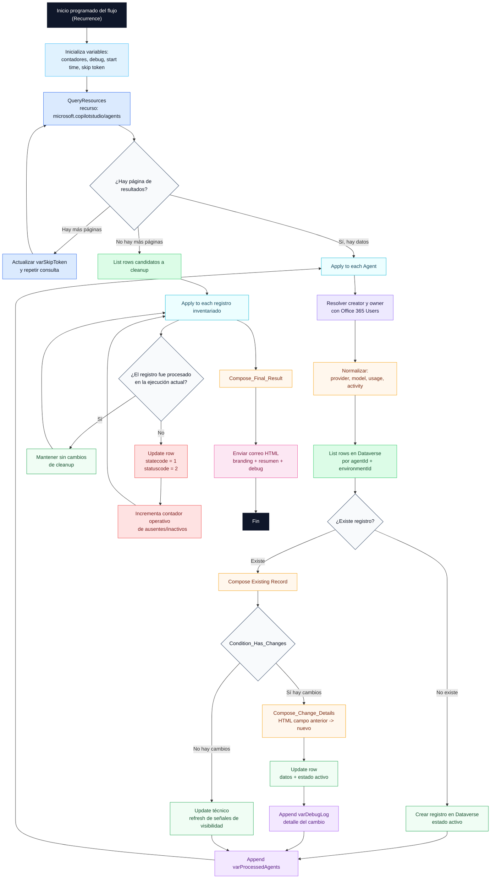

# Flujo de inventario y automatización

## Identificación

- Nombre: `KYN Agent Inventory tenant-wide`
- Archivo: `Workflows/KYNAgentInventorytenant-wide-EAE8C024-3BE4-4BD6-BAD5-E14E3435C632.json`
- Tipo de disparo: programado (`Recurrence`)

## Conectores utilizados

- `Power Platform Admins V2`
- `Dataverse`
- `Office 365 Users`
- conector de correo para envío del informe

## Diagrama operativo del flujo

## Lectura del diagrama

- azul: lectura del origen y paginación;
- violeta: resolución de identidad;
- naranja: composición y normalización;
- verde: lectura y escritura funcional en Dataverse;
- rojo: cleanup e inactivación;
- rosa: envío del informe;
- morado claro: trazabilidad y logging.

## Diagrama híbrido (arquitectura + excepciones)

```mermaid
flowchart LR
    subgraph T["Trigger"]
      T1["Recurrence"]:::trigger
    end

    subgraph I["Inicialización"]
      I1["Init vars:
      created, updated, markedMissing,
      errors, processedAgents, skipToken, runStart"]:::init
    end

    subgraph D["Discover y Paginación"]
      D1["QueryResources
      microsoft.copilotstudio/agents"]:::source
      D2{"skipToken vacío?"}:::decision
      D3["Set varSkipToken NextPage"]:::source
    end

    subgraph P["Proceso por Agente"]
      P1["Scope_Process_Agent"]:::scope
      P2["Resolver creator/owner
      (Office 365 Users)"]:::identity
      P3["Composes:
      modelProvider, modelName, activity"]:::compose
      P4["List Existing by key
      agentId + environmentId"]:::dataverse
      P5{"Existe registro?"}:::decision
      P6["Create_Agent_Record
      state=Active"]:::write
      P7["Compose_Existing_Record"]:::compose
      P8{"Condition_Has_Changes"}:::decision
      P9["Compose_Change_Details"]:::compose
      P10["Update_Agent_Record
      state=Active"]:::write
      P11["Refresh_Seen_Metadata"]:::write
      P12["Append_ProcessedAgent"]:::log
      P13["Append_Error_If_Failed"]:::error
    end

    subgraph C["Cleanup"]
      C1["List_All_Agent_Records"]:::dataverse
      C2{"Agent procesado en run?"}:::decision
      C3["Update_Stale_Record
      statecode=1 statuscode=2"]:::cleanup
      C4["Increment varMarkedMissing"]:::cleanup
    end

    subgraph N["Salida"]
      N1["Compose_Final_Result"]:::compose
      N2{"Hay destinatarios?"}:::decision
      N3["Send an email (V2)"]:::mail
      N4["Terminate Succeeded"]:::trigger
    end

    T1 --> I1 --> D1 --> D3 --> D2
    D2 -->|No| D1
    D2 -->|Sí| P1

    P1 --> P2 --> P3 --> P4 --> P5
    P5 -->|No| P6 --> P12
    P5 -->|Sí| P7 --> P8
    P8 -->|Sí| P9 --> P10 --> P12
    P8 -->|No| P11 --> P12
    P1 -. fallo .-> P13

    P12 --> C1 --> C2
    C2 -->|No| C3 --> C4 --> N1
    C2 -->|Sí| N1
    P13 --> N1

    N1 --> N2
    N2 -->|Sí| N3 --> N4
    N2 -->|No| N4

    classDef trigger fill:#0f172a,color:#ffffff,stroke:#0f172a,stroke-width:1px;
    classDef init fill:#e0f2fe,color:#0f172a,stroke:#38bdf8,stroke-width:1px;
    classDef source fill:#dbeafe,color:#0f172a,stroke:#2563eb,stroke-width:1px;
    classDef identity fill:#ede9fe,color:#1f1b4b,stroke:#8b5cf6,stroke-width:1px;
    classDef compose fill:#fff7ed,color:#7c2d12,stroke:#f59e0b,stroke-width:1px;
    classDef dataverse fill:#dcfce7,color:#14532d,stroke:#22c55e,stroke-width:1px;
    classDef write fill:#f0fdf4,color:#14532d,stroke:#16a34a,stroke-width:1px;
    classDef cleanup fill:#fee2e2,color:#7f1d1d,stroke:#ef4444,stroke-width:1px;
    classDef mail fill:#fce7f3,color:#831843,stroke:#ec4899,stroke-width:1px;
    classDef log fill:#f3e8ff,color:#581c87,stroke:#a855f7,stroke-width:1px;
    classDef scope fill:#ecfeff,color:#164e63,stroke:#06b6d4,stroke-width:1px;
    classDef decision fill:#f8fafc,color:#111827,stroke:#64748b,stroke-width:1.5px;
    classDef error fill:#ffe4e6,color:#881337,stroke:#fb7185,stroke-width:1px;
```

## Variables principales

- `varCreated`
- `varUpdated`
- `varMarkedMissing`
- `varErrors`
- `varProcessedAgents`
- `varRunStartTime`
- `varSkipToken`
- `varCreatedByDisplay`
- `varCreatedByEmail`
- `varOwnerIdDisplay`
- `varOwnerIdEmail`
- `varDebugLog`

## Parámetros

- `Notificación correos informes flujo (kyn_Notificacincorreosinformesflujo)`
- `Cliente o empresa informes flujo (kyn_ClienteoEmpresaInformesflujo)`

## Lógica detallada

1. Inicializa contadores, variables de contexto y el instante de inicio.
2. Ejecuta `QueryResources` sobre `microsoft.copilotstudio/agents`.
3. Gestiona paginación mediante `varSkipToken`.
4. Recorre cada agente descubierto.
5. Resuelve `createdBy` y `ownerId` mediante `Office 365 Users` cuando es posible.
6. Calcula normalizaciones:
   - proveedor de modelo;
   - modelo normalizado;
   - indicador de actividad;
   - indicador de uso.
7. Busca registro existente en Dataverse por clave funcional.
8. Si no existe:
   - crea el registro;
   - lo deja activo;
   - incrementa `varCreated`.
9. Si existe:
   - compone el registro actual;
   - evalúa `Condition_Has_Changes`;
   - si hay cambios materiales, actualiza el registro y agrega detalle HTML a `varDebugLog`;
   - si no hay cambios materiales, actualiza solo señales técnicas de visibilidad.
10. Añade el agente a `varProcessedAgents`.
11. Tras el recorrido, ejecuta cleanup sobre los registros no observados.
12. Para los no observados:
   - incrementa `varMarkedMissing` como contador operativo de ausentes/inactivos;
   - actualiza `statecode = 1` y `statuscode = 2`;
   - mantiene el registro sin borrado físico.
13. Construye un resultado final y envía correo HTML en español.

## Bloques funcionales

### 1. Descubrimiento y paginación

El flujo consulta el origen administrativo con `QueryResources` y mantiene un ciclo controlado por `varSkipToken` hasta agotar las páginas disponibles.

### 2. Resolución de identidad

Para cada agente, intenta convertir `createdBy` y `ownerId` en nombre visible y correo. Si no puede resolverlos:

- usa valores de fallback para display;
- deja vacío el email cuando no exista identidad resoluble.

### 3. Normalización

Antes de persistir, calcula:

- proveedor de modelo;
- modelo normalizado;
- indicador de actividad;
- indicador de uso.

Estas composiciones permiten reporting y comparación sin depender del JSON bruto.

### 4. Upsert lógico

La lógica no usa una simple escritura ciega:

- primero busca por clave funcional;
- crea si no existe;
- compara si existe;
- actualiza solo si detecta cambio material.

### 5. Trazabilidad de cambios

`Compose_Change_Details` genera un bloque HTML con:

- nombre del campo;
- valor anterior;
- valor nuevo.

Ese contenido se agrega a `varDebugLog` y se inserta después en el correo final.

### 6. Cleanup

Tras procesar los agentes observados:

- lista registros inventariados;
- comprueba cuáles no aparecen en `varProcessedAgents`;
- los marca inactivos en Dataverse;
- incrementa el contador operativo de ausentes.

### 7. Informe

El correo resume:

- creados;
- actualizados;
- ausentes o inactivos;
- errores;
- detalle de cambios materiales.

## Comparación material

La condición de cambio compara campos estables y funcionalmente relevantes, entre ellos:

- `displayName`
- `createdBy`
- `ownerId`
- `location`
- `createdIn`
- `schemaName`
- `entraAppId`
- `modelNormalized`
- `modelProvider`
- `usageIndicator`
- `activityIndicator`
- `isQuarantined`
- `resourceId`
- `resourceType`
- `tenantId`
- `environmentId`

La solución evita basarse en fechas crudas o blobs JSON para la detección de cambios principales, salvo donde sea necesario para enriquecer el dato.

## Log de cambios

El flujo construye un bloque HTML por agente actualizado con:

- nombre del campo;
- valor previo;
- valor nuevo.

Esto permite que el correo no solo diga cuántos cambios hubo, sino por qué se han considerado cambios.

## Cleanup y estado operativo

El comportamiento actual del flujo debe interpretarse así:

- no observado en la ejecución actual: inactivo;
- observado en la ejecución actual: activo;
- reaparición posterior: activo de nuevo.

## Hallazgo relevante de consistencia

- reaparición posterior: vuelve a activo;
- sin borrado físico automático.

## Correo final

El correo:

- usa asunto y cabecera parametrizados por cliente o empresa;
- resume creados, actualizados, ausentes y errores;
- muestra detalle HTML de cambios materiales;
- incluye timestamps y contexto operativo de la ejecución.
