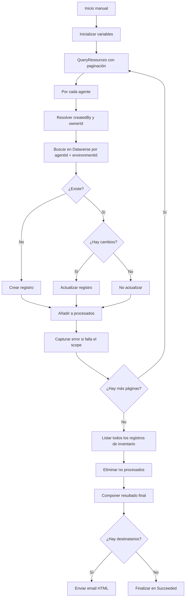

# Flujo de inventario y automatización

## 1. Identificación

- Nombre: `Agent Inventory tenant wide`
- Tipo exportado: workflow moderno / cloud flow
- Archivo: `Workflows/AgentInventorytenantwide-EDB8EFAD-CE22-F111-8341-6045BD09194B.json`
- Trigger observado: `Request` de tipo `Button`

Conclusión operativa: la versión exportada se lanza manualmente o desde otra invocación externa. No se observa un disparador de calendario dentro de este paquete.

## 2. Objetivo técnico

El flujo sincroniza el inventario de agentes hacia Dataverse y produce un resumen de ejecución con métricas de altas, cambios, bajas e incidencias.

## 3. Parámetro de configuración

| Parámetro | Tipo | Uso |
| --- | --- | --- |
| `Notificación correos informes flujo (yb_Notificacincorreosinformesflujo)` | String | Lista de correos separada por `;` para notificación de resultados |

Valor por defecto observado: `0`

## 4. Variables internas

| Variable | Tipo | Propósito |
| --- | --- | --- |
| `varSkipToken` | string | Controla la paginación del conector admin |
| `varCreated` | integer | Cuenta de registros creados |
| `varUpdated` | integer | Cuenta de registros actualizados |
| `varDeleted` | integer | Cuenta de registros eliminados |
| `varProcessedAgents` | array | Lista de claves funcionales procesadas `agentId|environmentId` |
| `varErrors` | array | Captura errores por agente |
| `varRunStartTime` | string | Hora de inicio de ejecución |
| `varCreatedByDisplay` | string | Nombre a persistir para creador |
| `varOwnerIdDisplay` | string | Nombre a persistir para propietario |
| `varDebugLog` | string | Detalle textual de diferencias detectadas |

## 5. Consulta fuente

El paso `Query_Power_Platform_Resources` llama a `QueryResources` sobre `PowerPlatformResources` con:

- filtro `type in 'microsoft.copilotstudio/agents'`
- proyección de campos:
  - `resourceId`
  - `location`
  - `agentId`
  - `tenantId`
  - `resourceType`
  - `environmentId`
  - `displayName`
  - `createdAt`
  - `createdBy`
  - `ownerId`
  - `isQuarantined`
  - `lastPublishedAt`
  - `createdIn`
  - `schemaName`
  - `entraAppId`
  - `orchestrationJson`
  - `authenticationJson`
  - `modelJson`

## 6. Secuencia funcional

## 7. Lógica detallada

### 7.1 Resolución de usuarios

Para `createdBy` y `ownerId`:

- si el valor es GUID vacío o cadena vacía, se guarda `System`,
- en otro caso se consulta `UserProfile_V2`,
- si la consulta falla, se conserva el valor recibido.

### 7.2 Matching de registros existentes

El flujo busca en Dataverse con:

- `yb_agentid eq <agentId>`
- `yb_environmentid eq <environmentId>`
- `top 1`

Esto define de hecho la identidad funcional del agente.

### 7.3 Creación

Si no existe registro:

- crea el registro en `yb_agenttenantwides`,
- incrementa `varCreated`.

### 7.4 Actualización

Si existe registro:

- compone el registro actual,
- evalúa la condición `Condition_Has_Changes`,
- actualiza solo si al menos uno de los campos comparados ha cambiado,
- incrementa `varUpdated`.

### 7.5 Limpieza de obsoletos

Tras procesar todas las páginas:

- lista hasta `5000` registros del inventario,
- construye claves `yb_agentid|yb_environmentid`,
- borra los registros cuya clave no esté en `varProcessedAgents`,
- incrementa `varDeleted`.

### 7.6 Notificación

Si la longitud del parámetro de correos es mayor que `1`:

- envía correo HTML con resumen,
- incluye conteos y detalle de errores,
- incluye `varDebugLog`.

Si no:

- termina el flujo en estado `Succeeded` sin correo.

## 8. Métricas generadas por el flujo

El resultado final compone estas medidas:

- `created`
- `updated`
- `deleted`
- `processed`
- `errors`
- `errorDetails`

Resumen textual:

- inicio de ejecución,
- fin de ejecución,
- creados,
- actualizados,
- eliminados,
- agentes procesados,
- errores.

## 9. Comportamiento ante errores

- Cada agente se procesa dentro de un scope.
- Si falla el scope del agente, se añade una entrada a `varErrors`.
- El flujo no aborta la ejecución global por el error de un único agente.

## 10. Limitaciones técnicas observadas

### 10.1 Alcance de descubrimiento restringido

La implementación actual consulta solo `microsoft.copilotstudio/agents`.

### 10.2 Riesgo de borrado por visión parcial

La limpieza elimina cualquier registro no presente en `varProcessedAgents`. Si la fuente devuelve un subconjunto por permisos, timeout, error parcial o cambio de filtro, se pueden eliminar registros válidos.

### 10.3 Detección de cambios incompleta

Cambios aislados en `createdBy`, `ownerId`, `createdAt`, `lastPublishedAt` o `yb_name` no activan update.

### 10.4 Sin clave alterna

No hay protección nativa frente a duplicados.

### 10.5 Trigger no programado

La exportación no contiene programación periódica interna.

El detalle de variables, conectores y expresiones está en [anexos/02_variables_y_expresiones_del_flujo.md](anexos/02_variables_y_expresiones_del_flujo.md).

