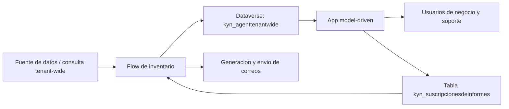

# 02 - Arquitectura funcional y tecnica

## Vision de arquitectura

La solucion esta construida como una composicion de capacidades Power Platform alrededor de Dataverse:

- Dataverse como capa maestra de persistencia;
- Power Automate como capa de ingesta, sincronizacion y distribucion;
- app model-driven como capa de operacion y administracion;
- reportes y vistas como capa de consumo.

## Arquitectura logica

## Componentes

### 1. Capa de datos

Dataverse es la fuente de verdad de la solucion. La tabla principal mantiene el inventario y la tabla de suscripciones controla la distribucion de reportes.

### 2. Capa de automatizacion

El flujo principal:

- obtiene los registros origen;
- compara o sincroniza contra Dataverse;
- construye salidas de reporte;
- consulta las suscripciones activas;
- evalua el modo de reporte por destinatario;
- envia el correo cuando la regla de validez se cumple.

### 3. Capa de experiencia

La app model-driven no es solo un contenedor visual. Es la interfaz oficial de operacion:

- consulta del inventario;
- acceso a vistas y formularios;
- mantenimiento de suscripciones por usuario o por equipo operativo.

## Decisiones de arquitectura

### Configuracion de reportes en tabla

Se adopta tabla dedicada para suscripciones en lugar de HTML, variables ocultas o listas incrustadas en flujo. La razon es simple:

- trazabilidad;
- auditabilidad;
- mantenimiento por app;
- desacoplamiento entre interfaz y logica de correo.

### Fallback legacy

La columna `kyn_reportmode` se mantiene como compatibilidad hacia atras mientras existan datos historicos. El modo principal ya no debe depender de texto libre, sino de `kyn_reportmodecode`.

### Coherencia entre componentes

Toda modificacion funcional que afecte reportes debe reflejarse en:

- modelo de datos;
- formularios y vistas;
- flujo;
- documentacion.

Si uno de estos cuatro elementos no se actualiza, la solucion queda funcionalmente incoherente.
