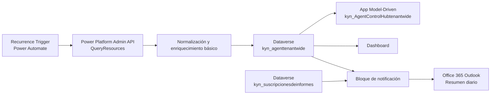
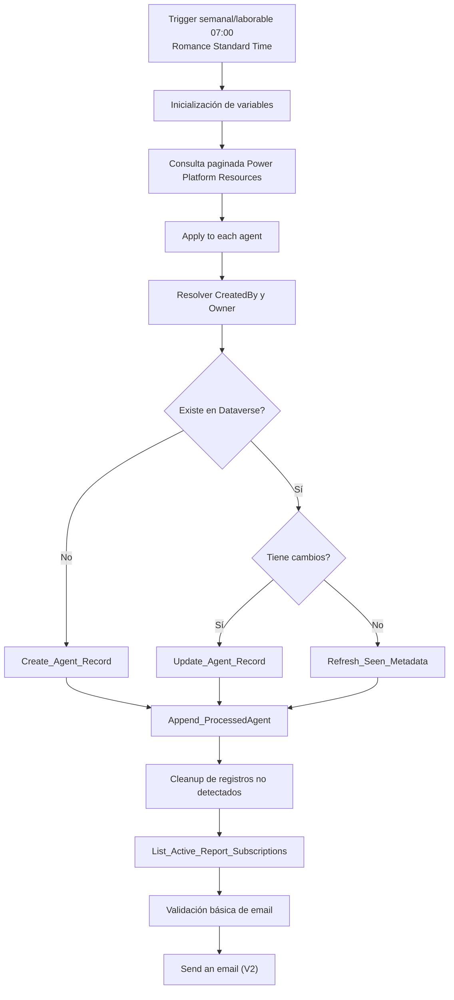

# Arquitectura funcional y técnica

## Vista general

La arquitectura actual está compuesta por una solución Dataverse + model-driven app + un flujo programado.

## Componentes y responsabilidad

### 1. Flujo principal

Responsabilidad:

- ejecutar la ingesta periódica;
- consultar recursos del tenant;
- comparar con inventario existente;
- crear, actualizar y marcar registros;
- enviar resumen por correo.

Conectores identificados:

- `shared_powerplatformadminv2`
- `shared_commondataserviceforapps`
- `shared_office365users`
- `shared_office365`

### 2. Tabla de inventario

`kyn_agenttenantwide` es la tabla de trabajo principal.

Responsabilidad:

- persistir el inventario consolidado;
- almacenar información de procedencia, propietario, estado y sincronización;
- servir de fuente para la app, dashboard e informe.

### 3. Tabla de suscripciones

`kyn_suscripcionesdeinformes` contiene los destinatarios del resumen.

Responsabilidad:

- permitir altas/bajas de suscripciones desde la app;
- actuar como origen funcional de destinatarios;
- desacoplar la distribución del correo de listas hardcoded.

### 4. App model-driven

Responsabilidad:

- exponer el inventario;
- permitir navegar agentes y suscripciones;
- concentrar la experiencia funcional de explotación.

### 5. Dashboard

Responsabilidad:

- ofrecer lectura agregada del inventario desde la app.

## Arquitectura lógica detallada

## Dependencias técnicas

### Dependencias explícitas

En `solution.xml` se observan dependencias de configuración de app:

- `EnablePowerBIQuickReport`
- `FormFillBarUXEnabled`
- `HeaderAndNavigationRefresh`

Esto debe quedar controlado en despliegues a otros entornos porque afecta a la app model-driven.

### Dependencias implícitas

El flujo necesita:

- connection references válidas para Power Platform Admin, Dataverse, Office 365 Users y Outlook;
- permisos sobre lectura de recursos del tenant;
- permisos de escritura sobre ambas tablas Dataverse;
- una configuración consistente entre parámetros del flujo y variables de entorno exportadas.

## Observaciones de arquitectura

La arquitectura actual es funcional, pero no está completamente separada por responsabilidades:

- el mismo flujo hace descubrimiento, persistencia, limpieza y notificación;
- el bloque de correo está embebido en el flujo principal;
- aún existen artefactos legacy de presentación HTML y debug;
- el web resource `kyn_Report_Subscriptions` sigue siendo componente raíz aunque el diseño funcional deseado es gestionar suscripciones desde entidad/formulario estándar.

Desde un punto de vista técnico, la evolución más sana es:

1. separar sincronización y notificación;
2. eliminar artefactos legacy no usados;
3. alinear variables de entorno declaradas con variables realmente exportadas;
4. cerrar el modelo de datos eliminando columnas residuales no funcionales.
