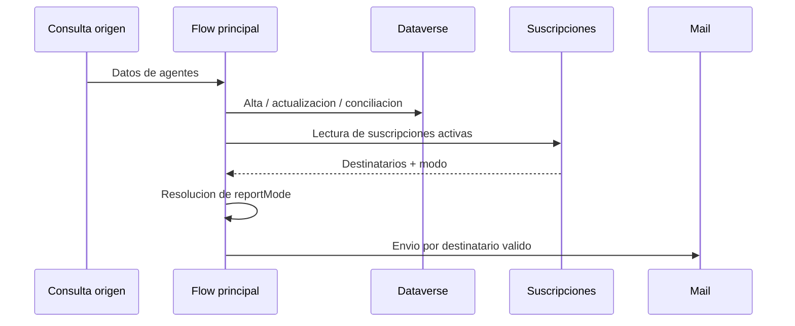

# 04 - Automatizacion y flujos

## Flujo principal

El flujo operativo principal de la solucion es `KYN Agent Inventory tenant-wide_ whitout UPN search`. Su responsabilidad es sincronizar inventario y generar comunicaciones de salida.

## Secuencia funcional

## Logica de resolucion del modo de reporte

La logica actual recomendada es:

1. leer `kyn_reportmodecode`;
2. si existe, mapearlo a su modo funcional;
3. si no existe, usar `kyn_reportmode` como fallback;
4. normalizar a mayusculas;
5. excluir `OFF` y `NONE` del envio.

## Expresiones clave

Las expresiones operativas estan documentadas en `anexos/02_expresiones_flujo.txt`.

Puntos criticos:

- no aplicar `empty()` sobre choice numerico;
- convertir con `int()` cuando se comparan codigos;
- convertir con `string()` cuando se hace trim o validacion textual.

## Regla de envio

Un correo solo debe salir si se cumplen dos condiciones:

- destinatario valido;
- modo distinto de `OFF` o `NONE`.

## Riesgos funcionales observados en la evolucion

- condiciones invertidas que bloquean el envio valido;
- expresiones con tipos incorrectos;
- dependencias antiguas de variables de entorno para destinatarios;
- inclusion de componentes de flujo o workflow obsoletos dentro del paquete.

## Recomendacion de evolucion

Si la solucion crece, la siguiente mejora razonable es separar la generacion del inventario y la distribucion del reporte en dos flujos:

- flujo padre de sincronizacion;
- flujo hijo de composicion y envio.

Esa separacion mejora soporte y reduce impacto cuando falla solo la parte de notificaciones.
