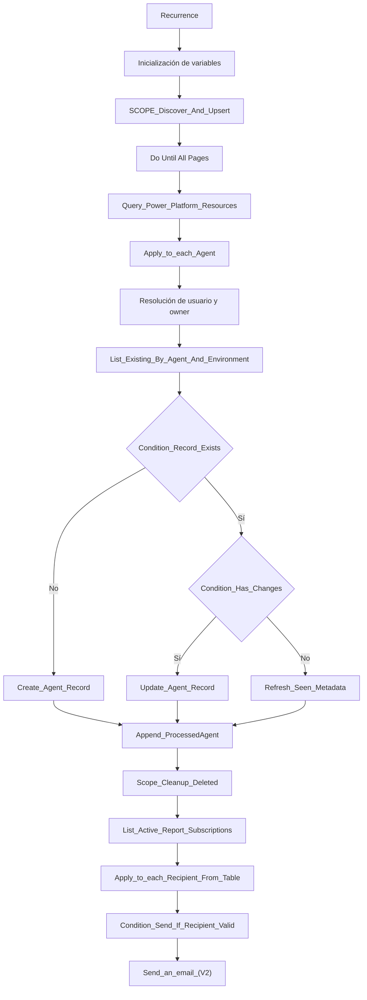

# Flujo principal Power Automate

## Identificación

- Nombre: `KYN Agent Inventory tenant-wide`
- Tipo: flujo programado
- Trigger: `Recurrence`
- Frecuencia observada:
  - semanal
  - lunes a viernes
  - 07:00
  - `Romance Standard Time`

## Objetivo del flujo

El flujo tiene cuatro responsabilidades principales:

1. descubrir agentes a nivel tenant;
2. consolidar y actualizar inventario en Dataverse;
3. marcar registros ya no detectados;
4. enviar un resumen por correo a los destinatarios suscritos.

## Conectores usados

- Power Platform Admin:
  - `kyn_ConnectionReferencePowerPlatformAdminsTenantwide`
- Dataverse:
  - `kyn_ConnectionReferenceDataverseTenantwide`
- Office 365 Users:
  - `kyn_sharedoffice365users_f32b7`
- Office 365 Outlook:
  - `kyn_ConnectionReferenceAgentInventoryTenantwide`

## Arquitectura del flujo



## Paso a paso

### 1. Inicialización

Variables detectadas:

- `varSkipToken`
- `varCreated`
- `varUpdated`
- `varMarkedMissing`
- `varProcessedAgents`
- `varErrors`
- `varRunStartTime`
- `varCreatedByDisplay`
- `varOwnerIdDisplay`
- `varCreatedByEmail`
- `varOwnerIdEmail`

Variables legacy todavía presentes:

- `Initialize_variable_varDebugLog`
- `Init_varCreatedAgentsHtml`
- `Init_varCreatedNonSystemHtml`

Valoración:

- estas variables legacy deben retirarse si ya no forman parte del correo final;
- mantenerlas dificulta el mantenimiento y genera ruido documental y funcional.

### 2. Consulta del tenant

Acción principal:

- `Query_Power_Platform_Resources`

Función:

- consulta `PowerPlatformResources`;
- filtra por recursos tipo `microsoft.copilotstudio/agents`;
- proyecta los campos necesarios para poblar o actualizar inventario;
- soporta paginación mediante `varSkipToken`.

### 3. Proceso por agente

Dentro de `Apply_to_each_Agent` el flujo:

- resuelve `createdBy` y `ownerId`;
- evita fallos con GUID `0000...` o valores vacíos;
- calcula `ActivityIndicator`;
- busca el registro existente por `agentId + environmentId`;
- decide si crear o actualizar;
- registra el agente como procesado.

### 4. Limpieza de registros no detectados

Bloque:

- `Scope_Cleanup_Deleted`

Función:

- recorre registros existentes;
- identifica agentes no vistos en la ejecución actual;
- actualiza su estado o contador en lugar de hacer borrado duro.

Este patrón es correcto para gobierno:

- evita pérdida de trazabilidad;
- permite distinguir entre ausencia temporal y desaparición sostenida;
- facilita auditoría funcional.

### 5. Recuperación de suscripciones

Acción:

- `List_Active_Report_Subscriptions`

Función:

- consulta la tabla `kyn_suscripcionesdeinformes`;
- recupera destinatarios activos.

### 6. Validación de destinatario

Bloque:

- `Apply_to_each_Recipient_From_Table`
- `Condition_Send_If_Recipient_Valid`

La validación actual debe ser simple y estable:

```text
@contains(trim(string(item()?['kyn_recipientemail'])), '@')
```

Esta validación es suficiente como filtro mínimo de formato, aunque no sustituye validaciones más estrictas de calidad del dato.

### 7. Envío de correo

Acción:

- `Send_an_email_(V2)`

Características observadas:

- asunto basado en la variable de entorno `kyn_ClienteoEmpresaInformesflujo`;
- cuerpo HTML con resumen ejecutivo;
- enlaces condicionados a parámetros de URL de app y vistas;
- envío individual por destinatario.

## Configuración observada del correo

El diseño actual del correo apunta a una estrategia correcta:

- correo ejecutivo;
- sin necesidad de volcar todo el log técnico;
- con enlace a la app como fuente de verdad.

Sin embargo, el estado del repositorio es inconsistente:

- el flujo referencia parámetros para:
  - `kyn_UrlAppGeneralAgentInventory`
  - `kyn_UrlVistaAgentesCreadosAgentInventory`
  - `kyn_UrlVistaAgentesEliminadosAgentInventory`
- pero en `environmentvariabledefinitions/` solo está presente físicamente:
  - `kyn_ClienteoEmpresaInformesflujo`

Esto debe corregirse antes de considerar el paquete completamente consistente.

## Valoración técnica actual

Fortalezas:

- el flujo centraliza bien descubrimiento, sincronización y notificación;
- el patrón `upsert + mark missing` es correcto;
- usar una tabla de suscripciones es mejor que correos hardcoded;
- el correo ejecutivo es más profesional que un log técnico embebido.

Debilidades:

- demasiada responsabilidad en un único flujo;
- variables legacy aún presentes;
- inconsistencias entre parámetros del flujo y variables exportadas;
- riesgo de errores al activar si se siguen parcheando expresiones sin saneamiento global;
- no existe separación real entre sincronización y notificación.

## Recomendación de evolución

La siguiente evolución técnica recomendable es:

1. dejar el flujo actual estable y activable;
2. eliminar variables y acciones legacy no utilizadas;
3. alinear variables de entorno exportadas con los parámetros efectivos;
4. en una siguiente versión, separar:
   - flujo padre de sincronización;
   - flujo hijo o mecanismo desacoplado de notificación.
