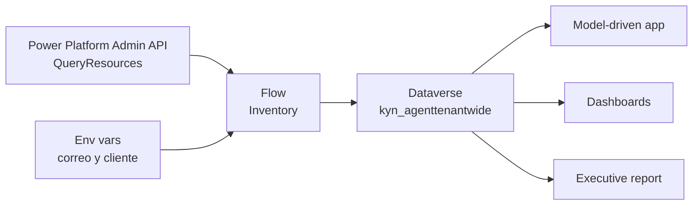

# Arquitectura funcional y técnica

## Componentes

| Capa | Tipo | Componente | Función |
| --- | --- | --- | --- |
| Descubrimiento | Cloud flow | `KYN Agent Inventory tenant-wide` | descubre agentes y sincroniza el inventario |
| Persistencia | Dataverse | `kyn_agenttenantwide` | almacena el inventario consolidado |
| Experiencia | Model-driven app | `KYN Agent Inventory tenant-wide APP` | navegación y acceso controlado |
| Analítica | Dashboards + report | vistas y reporte ejecutivo | explotación operativa |
| Parametrización | Variable de entorno | `kyn_Notificacincorreosinformesflujo` | destinatarios del correo |
| Parametrización | Variable de entorno | `kyn_ClienteoEmpresaInformesflujo` | nombre de empresa/cliente para el correo |

## Diagrama lógico

## Patrón de sincronización

- el flujo solo actualiza cuando detecta cambios materiales en campos estables;
- el refresco técnico de `lastSeenOn` no incrementa `Updated`;
- el correo final muestra qué campo cambió, valor previo y valor nuevo;
- el cleanup no borra físicamente registros;
- la primera ausencia marca el registro como no visto;
- tras varias ausencias consecutivas, el registro debe pasar a inactivo para mantener limpio el inventario operativo sin perder histórico.

## Importabilidad

- prefijo y publisher propios `KYN`;
- sin `WebResources` SVG personalizados en el paquete;
- sin flujo de enriquecimiento adicional;
- parametrización del correo mediante variables de entorno.
